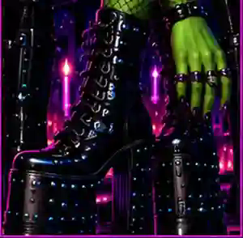

# The Vice City Sinner — Visual Source of Truth

This guide separates **site identity** from **story-specific editorial artwork**. A story image can have its own visual concept without redefining the entire Vice City Sinner site.

Editorial personality and subject breadth are defined separately in [`EDITORIAL-GUIDE.md`](EDITORIAL-GUIDE.md). That guide is the source of truth for what VCS *is about*; this file is the source of truth for how the site and story art are visually handled.

## 1. Site identity — locked

The overall publication keeps the established Vice City Sinner system: black foundation, purple/magenta neon framing, acid-green highlights, large editorial serif headlines, compact uppercase utility text, and the existing masthead/navigation language.

The original homepage and newsletter mockups supplied by Satanica Lux remain the source of truth for the publication-level look. Do **not** replace that identity with the visual theme of one article.

Important: goth and kink are subjects within the publication, not the publication's entire visual or editorial identity. Avoid defaulting every image toward dungeons, fetish hardware, gothic fantasy, or generic "alternative" imagery simply because those elements appear elsewhere in the project.

## 2. Story art — assigned by article

Story art must be intentional, crisp, and relevant to the article. These assignments are locked until Satanica Lux changes them.

### Editorial — Out of the Foxhole and Into Real Life

Role: primary artwork for the Foxhole story. The previously rejected Satanica photo is not to be used as the homepage hero.

### Style — I’m Bringing Back Hair Metal Fashion. Sorry Not Sorry.

Role: style-story artwork. The approved **Nine No-Brainer Hair Metal Revival Combos** guide is a story-specific editorial reference and supporting asset. It does **not** dictate the theme of the whole website.

### Culture / Identity — Wait, What’s Your Real Name?

Role: primary identity-story artwork.

### Kink History — Who the Fuck Invented the Dungeon?

Role: primary kink-history artwork.

## 3. Approval states

- **Approved / Live:** may be used on the site in its assigned role.
- **Working / Needs approval:** may be explored, but must not be published or silently reassigned.
- **Rejected / Do not use:** must not return later because it happens to be available in the repository.

## 4. Rejected / do not use

- The rejected Satanica homepage hero photo.
- The text-heavy infographic SVGs previously created as replacements for article artwork: `art-foxhole.svg`, `art-hair-metal.svg`, `art-real-name.svg`, and `art-dungeon.svg`.
- Unapproved photographs of Satanica Lux.
- Generic portrait substitution when a story has assigned artwork.
- Cropping an image so aggressively that the artwork or embedded text becomes unreadable.
- Treating the Hair Metal guide as a site-wide redesign brief.
- Publishing About copy without explicit approval.
- Treating kink, goth, fetish, trauma, or "edginess" as a default visual shorthand for Satanica Lux or VCS.

## 5. Layout rules

- Artwork should be shown in full whenever it contains text or intentional composition.
- Mobile presentation is the first validation target.
- Never upscale a tiny source into a giant hero and call the result finished.
- Site navigation, masthead, and publication identity stay visually consistent even when individual story art changes.
- If the art direction does not make sense for the specific story without knowing Satanica is goth or kinky, rethink the concept.

## 6. Internal visual guide

For a browser-rendered version with the live assets, open [`STYLE-GUIDE.html`](STYLE-GUIDE.html).
