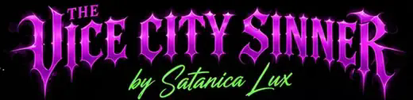
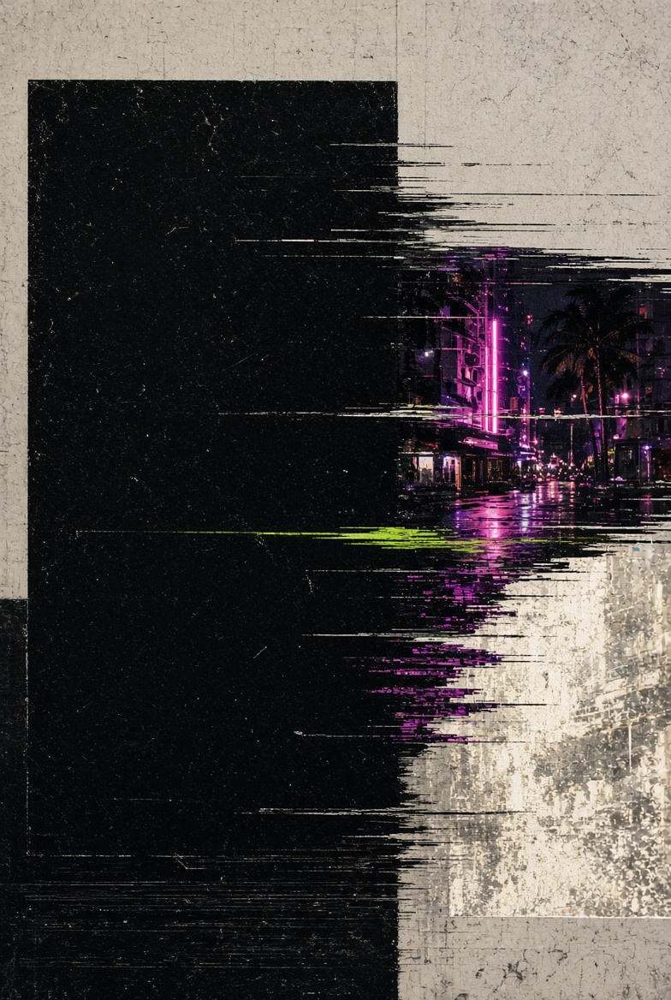

# The Vice City Sinner — Visual Source of Truth

This guide separates **site identity** from **story-specific editorial artwork**. A story image can have its own visual concept without redefining the entire Vice City Sinner site.

Satanica's character identity is defined in [`SATANICA-MASTER-BIBLE.md`](SATANICA-MASTER-BIBLE.md). Editorial personality and subject breadth are defined in [`EDITORIAL-GUIDE.md`](EDITORIAL-GUIDE.md). The Master Bible controls Satanica herself; the editorial guide controls what VCS is about; this file controls how the site and story art are visually handled.

## 1. Site identity — locked

The overall publication keeps the established Vice City Sinner system: black foundation, purple/magenta neon framing, acid-green highlights, large editorial serif headlines, compact uppercase utility text, and the existing masthead/navigation language.

The original homepage and newsletter mockups supplied by Satanica Lux remain the source of truth for the publication-level look. Do **not** replace that identity with the visual theme of one article.

Important: goth and kink are subjects within the publication, not the publication's entire visual or editorial identity. Avoid defaulting every image toward dungeons, fetish hardware, gothic fantasy, or generic "alternative" imagery simply because those elements appear elsewhere in the project.

## 2. Poster rule — locked

Promotional posters are **not** interchangeable with article artwork.

Do not use poster graphics with embedded slogans or headlines as homepage heroes, story cards, or article heroes unless Satanica Lux explicitly approves that exact poster for that exact role. Availability in the repository is not approval.

This includes poster-style treatments such as **More Than a Name**, **Same Bitch Brighter Now**, **Good Girls Read Here Too**, and similar promotional compositions.

## 3. Story art — assigned by article

Story art must be intentional, crisp, and relevant to the article. These assignments are locked until Satanica Lux changes them.

### Editorial — Out of the Foxhole and Into Real Life

**Article hero — approved / locked:** `assets/foxhole-satanica.png`

Use the approved Image Lab portrait for the Foxhole article hero: Satanica standing confidently beside a gothic throne in a purple-lit chamber, with the locked Look Bible appearance and approved acid-lime skin tone. Use this exact uploaded PNG for the article hero and display the full portrait without cropping. Do not substitute the earlier doorway image, the tiny `editorial-satanica.avif`, or a regenerated Satanica variation.

**Homepage hero — approved / locked:** `assets/homepage-hero-satanica.png`

The homepage hero uses the approved green Satanica imagery: Satanica climbing clearly out of a dark underground passage/foxhole into bright South Florida daylight. Her hands and raised knee are visibly braced on the opening so the action reads immediately rather than looking like she is crawling in dirt. Use this exact approved 1448×1086 hero for the homepage feature. Show the full 4:3 composition cleanly and do not replace it with an unapproved portrait, generic goth imagery, a poster treatment, or a stretched low-resolution source.

### Style — I’m Bringing Back Hair Metal Fashion. Sorry Not Sorry.

**Article header — approved / locked:** `assets/hair-metal-header-satanica.avif`

The Hair Metal article header uses the established green Satanica character system in a backstage/dressing-room scene: lime-green skin, blue-black hair, forehead star, black leather, fishnets, stacked jewelry, platform boots, purple/magenta lighting, and South Florida atmosphere. This is the approved article-header image. Do not replace it with a generic model, poster graphic, or non-Satanica fashion image.

`assets/card-style.svg` remains the compact Hair Metal story artwork where a card-sized asset is needed.

**Hair Metal outfit guide — approved / live:** `assets/hair-metal-guide-1-3-full.png`, `assets/hair-metal-guide-4-6-full.png`, and `assets/hair-metal-guide-7-9-full.png`.

The approved **Nine No-Brainer Hair Metal Revival Combos** guide uses the three Green Satanica editorial pages for combos 1–3, 4–6, and 7–9. These exact visual pages are the live guide. The three approved 941×1672 PNG pages are displayed as normal responsive images at their natural aspect ratio with no cropping or background-image slicing. The underlying HTML combo copy remains in the article for accessibility, but it is not the visible design.

### Culture / Identity — Wait, What’s Your Real Name?

**Approved / locked:** `assets/identity-satanica.avif`

Use this exact 1448×1086 Green Satanica editorial artwork for the story and its homepage card. Satanica is seated at a neon-lit vanity holding an ornate mask; the scene represents chosen identity and self-authorship without requiring readable prop text. Character appearance follows the Satanica Look Bible v1.0: acid-green skin, blue-black electric-cobalt hair, symmetrical purple horns, magenta eyes, black-plum lips, centered four-point forehead star, curvy soft build, smaller chest, and dense arm/hand tattoos. Do not substitute the **More Than a Name** promotional poster, a generic model, or a regenerated variant.

### History — Who the Fuck Invented the Dungeon?

**Article/homepage artwork — approved / locked:** `assets/dungeon-satanica.avif`

Use the approved 1448×1086 Green Satanica history scene: Satanica studies an old illustrated archive book in a dense, candlelit room surrounded by period-feeling dungeon objects, restraints, leather, archival prints, books, and workshop/play-space details. The image should read as curious historical investigation rather than generic fetish glamour. Use this exact approved asset for the Dungeon article hero and homepage story card. Do not replace it with the earlier doorway graphic, poster treatment, unrelated dungeon imagery, or an unapproved Satanica variation.

## 4. Approval states

- **Approved / Live:** may be used on the site in its assigned role.
- **Working / Needs approval:** may be explored, but must not be published or silently reassigned.
- **Rejected / Do not use:** must not return later because it happens to be available in the repository.

## 5. Rejected / do not use

- Poster-style story substitutions: `assets/story-editorial-illustration.jpeg` and `assets/story-identity-illustration.jpeg`.
- The rejected Satanica homepage hero photo.
- The text-heavy infographic SVGs previously created as replacements for article artwork: `art-foxhole.svg`, `art-hair-metal.svg`, `art-real-name.svg`, and `art-dungeon.svg`.
- Unapproved photographs of Satanica Lux.
- Generic portrait substitution when a story has assigned artwork.
- Cropping an image so aggressively that the artwork or embedded text becomes unreadable.
- Treating the Hair Metal guide as a site-wide redesign brief.
- Publishing About copy without explicit approval.
- Treating kink, goth, fetish, trauma, or "edginess" as a default visual shorthand for Satanica Lux or VCS.

## 6. Layout rules

- Artwork should be shown in full whenever it contains text or intentional composition.
- Mobile presentation is the first validation target.
- Never upscale a tiny source into a giant hero and call the result finished.
- Site navigation, masthead, and publication identity stay visually consistent even when individual story art changes.
- If the art direction does not make sense for the specific story without knowing Satanica is goth or kinky, rethink the concept.

## 7. Internal visual guide

For a browser-rendered version with the live assets, open [`STYLE-GUIDE.html`](STYLE-GUIDE.html).
