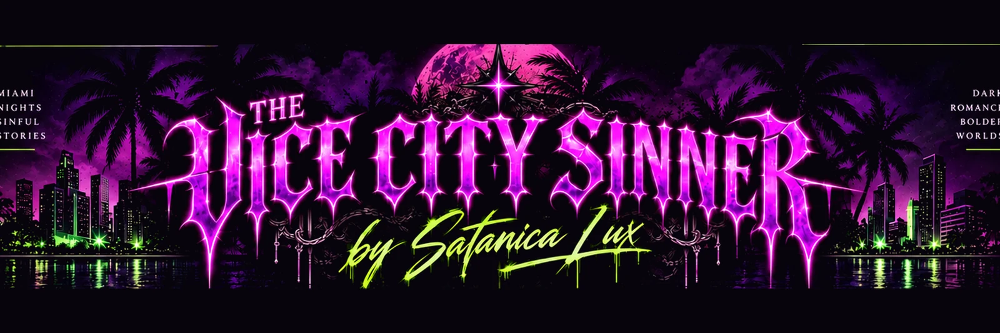
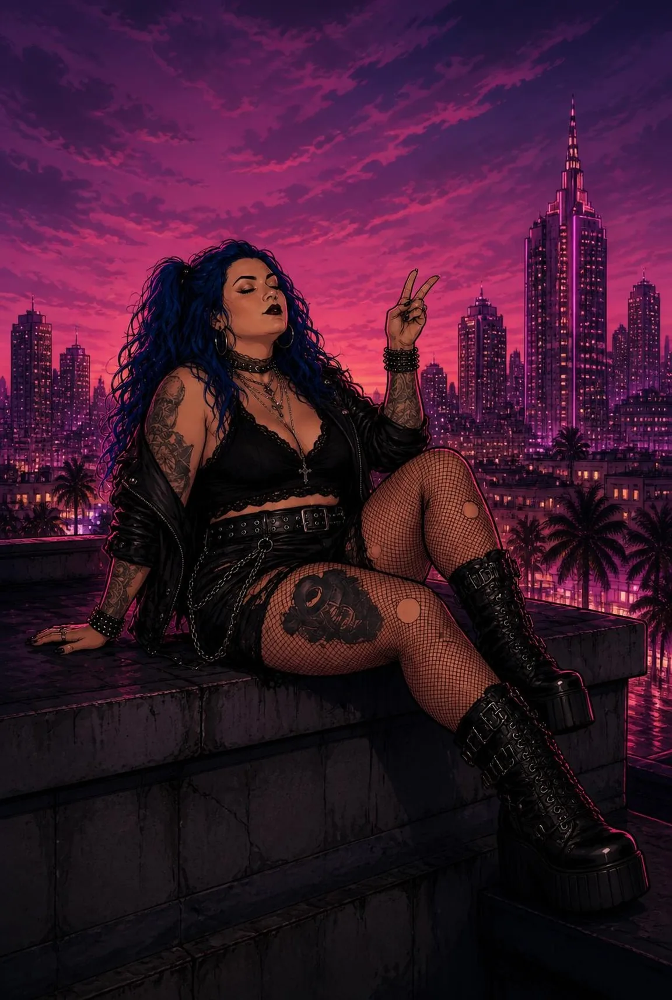
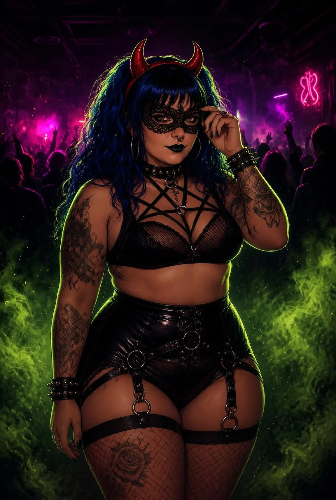
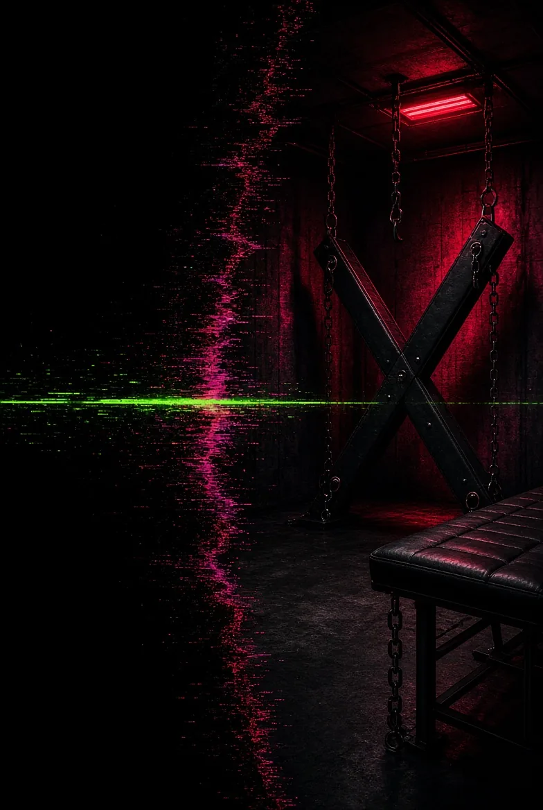

# The Vice City Sinner — Visual Source of Truth

This guide separates **site identity** from **story-specific editorial artwork**. A story image can have its own visual concept without redefining the entire Vice City Sinner site.

Satanica's character identity is defined in [`SATANICA-MASTER-BIBLE.md`](SATANICA-MASTER-BIBLE.md). Editorial personality and subject breadth are defined in [`EDITORIAL-GUIDE.md`](EDITORIAL-GUIDE.md). The Master Bible controls Satanica herself; the editorial guide controls what VCS is about; this file controls how the site and story art are visually handled.

## 1. Site identity — locked

The masthead is the lock plate, `assets/vcs-lock-banner.png` (locked 2026-09-25). Pages load its WebP copy, `assets/vcs-lock-banner-web.webp`, in the header and footer. The older `assets/logo.svg` masthead is no longer used on the site.

The overall publication keeps the established Vice City Sinner system: black foundation, purple/magenta neon framing, acid-green highlights, large editorial serif headlines, compact uppercase utility text, and the existing masthead/navigation language.

The original homepage and newsletter mockups supplied by Satanica Lux remain the source of truth for the publication-level look. Do **not** replace that identity with the visual theme of one article.

Important: goth and kink are subjects within the publication, not the publication's entire visual or editorial identity. Avoid defaulting every image toward dungeons, fetish hardware, gothic fantasy, or generic "alternative" imagery simply because those elements appear elsewhere in the project.

## 2. Poster rule — locked

Promotional posters are **not** interchangeable with article artwork.

Do not use poster graphics with embedded slogans or headlines as homepage heroes, story cards, or article heroes unless Satanica Lux explicitly approves that exact poster for that exact role. Availability in the repository is not approval.

This includes poster-style treatments such as **More Than a Name**, **Same Bitch Brighter Now**, **Good Girls Read Here Too**, and similar promotional compositions.

## 3. Story art — assigned by article

Story art must be intentional, crisp, and relevant to the article. These assignments are locked until Satanica Lux changes them.

What the live pages load (2026-09-28). Each page uses the `-web.webp` copy; the original sits next to it in `assets/`.

| Role | Original | Page loads | Size |
| --- | --- | --- | --- |
| Homepage feature (Foxhole) | `homepage-hero-satanica.png` | `homepage-hero-satanica-web.webp` | 1152×1712 |
| Foxhole article hero | `foxhole-satanica.png` | `foxhole-satanica-web.webp` | 784×1168 |
| Hair Metal header + homepage card | `hair-metal-header-satanica-hq.png` | `hair-metal-header-satanica-web.webp` | 1152×1712 |
| Hair Metal outfit guide | — | `guide-page-1.jpg`, `guide-page-2.jpg`, `guide-page-3.jpg` | 1008×1792 |
| Real Name hero + homepage card | `identity-satanica.png` | `identity-satanica-web.webp` | 1152×1712 |
| Dungeon hero + homepage card | `dungeon-satanica.png` | `dungeon-satanica-web.webp` | 784×1168 |

On the page, article heroes show as a 200px-high band across the column and homepage images as a 210px (feature) or 168px (cards) band, cropped with `object-fit: cover`.

**Current art direction — approved by Satanica Lux, 2026-09-28: torn offset print / glitch static.** Every live hero is a real-feeling photograph of a place or object (South Beach streets, leather, a mask, an empty play space) with no person in it. Each one is broken up by horizontal print-static tears and a magenta smear, plus one thin acid-green scan line, and sits on black or on cracked, distressed paper. Satanica herself does not appear in the story art. The only illustrated Satanica on the site is in the Hair Metal outfit guide pages.

**Retired:** the earlier green-Satanica character scenes (the Foxhole throne portrait, Satanica climbing out of the foxhole, the dressing-room, vanity and archive-book scenes). They are superseded and are not current art direction. Their old descriptions are kept below, marked retired, for the record only.

### Editorial — Out of the Foxhole and Into Real Life

**Article hero — approved / locked:** `assets/foxhole-satanica.png` (the page loads `assets/foxhole-satanica-web.webp`)

A tall black doorway-shaped block torn through a cracked, cream-grey concrete wall. Through the tear on its right edge, a rain-slick South Beach street at night: a hot-pink neon Deco building, palm trees, and wet pavement reflecting magenta. The edge of the black block shreds into horizontal glitch streaks, with a purple-magenta smear and one acid-green scan line across the middle. No person. Page alt text: “A black doorway torn through a cracked concrete wall, opening onto a rain-slick neon street with palm trees at night, in glitched offset print.” The page crops it to the 200px band, so the neon street strip carries the image. Do not substitute the retired throne portrait, the tiny `editorial-satanica.avif`, or a regenerated Satanica variation.

> **Retired 2026-09-28, no longer current:** Use the approved Image Lab portrait for the Foxhole article hero: Satanica standing confidently beside a gothic throne in a purple-lit chamber, with the locked Look Bible appearance and approved acid-lime skin tone. Use this exact uploaded PNG for the article hero and display the full portrait without cropping. Do not substitute the earlier doorway image, the tiny `editorial-satanica.avif`, or a regenerated Satanica variation.

**Homepage hero — approved / locked:** `assets/homepage-hero-satanica.png` (the page loads `assets/homepage-hero-satanica-web.webp`)

Ocean Drive at night in torn offset print. A weathered “OCEAN DRIVE / MIAMI BEACH” street sign on the left, palm trees, an Art Deco hotel striped with pink neon on the right, and an empty rain-wet street reflecting magenta down the middle. The whole scene is framed by jagged shards of torn black paper, with a single acid-green strip on the left edge. Mostly black-and-white with magenta neon. No person. Page alt text: “Ocean Drive at night in torn offset print.” Portrait 1152×1712, cropped on the homepage to a 210px band. Do not replace it with an unapproved portrait, generic goth imagery, a poster treatment, the retired green-Satanica scene, or a stretched low-resolution source.

> **Retired 2026-09-28, no longer current:** The homepage hero uses the approved green Satanica imagery: Satanica climbing clearly out of a dark underground passage/foxhole into bright South Florida daylight. Her hands and raised knee are visibly braced on the opening so the action reads immediately rather than looking like she is crawling in dirt. Use this exact approved 1448×1086 hero for the homepage feature. Show the full 4:3 composition cleanly and do not replace it with an unapproved portrait, generic goth imagery, a poster treatment, or a stretched low-resolution source.

### Style — I’m Bringing Back Hair Metal Fashion. Sorry Not Sorry.

**Article header — approved / locked:** `assets/hair-metal-header-satanica-hq.png` (the article and its homepage card load `assets/hair-metal-header-satanica-web.webp`; the old 511×341 `assets/hair-metal-header-satanica.avif` is no longer used)

A studded black leather moto jacket in close-up on the right: buckled collar strap, silver studs, heavy zipper. Warm amber dressing-room bulbs blur behind it at the top right. The left half dissolves into black print static, magenta pixel static tears across the jacket, and one acid-green scan line runs straight through. No person. Page alt text: “Studded leather jacket tearing through dressing-room static.” This is the approved article-header image and the homepage Hair Metal card. Do not replace it with a generic model, a poster graphic, or the retired dressing-room Satanica scene.

> **Retired 2026-09-28, no longer current:** The Hair Metal article header uses the established green Satanica character system in a backstage/dressing-room scene: lime-green skin, blue-black hair, forehead star, black leather, fishnets, stacked jewelry, platform boots, purple/magenta lighting, and South Florida atmosphere. This is the approved article-header image. Do not replace it with a generic model, poster graphic, or non-Satanica fashion image.

`assets/card-style.svg` remains the compact Hair Metal story artwork where a card-sized asset is needed. No live page uses it right now; the homepage card uses the header art.

**Hair Metal outfit guide — approved / live:** `assets/guide-page-1.jpg`, `assets/guide-page-2.jpg`, and `assets/guide-page-3.jpg`. (The earlier `assets/hair-metal-guide-1-3-full.png`, `-4-6-full.png` and `-7-9-full.png` are no longer on the page.)

The approved **Nine No-Brainer Hair Metal Revival Combos** guide uses the three illustrated Satanica style-guide pages for combos 1–3, 4–6, and 7–9 (Satanica with blue-black hair and forehead star in black leather, lace and fishnets, beside labelled item swatches, with magenta numbered headings). These exact visual pages are the live guide. The three approved 1008×1792 JPEG pages are displayed as normal responsive images at their natural aspect ratio with no cropping or background-image slicing. The underlying HTML combo copy remains in the article for accessibility, but it is not the visible design.

### Culture / Identity — Wait, What’s Your Real Name?

**Approved / locked:** `assets/identity-satanica.png` (the article and its homepage card load `assets/identity-satanica-web.webp`)

A black leather hood with empty eye holes fills the lower right, with an ornate dark mirror frame and one warm bulb above it. The left side is black and grey print static, torn by a magenta smear and a magenta waveform running down beside the hood, with one acid-green scan line. No face, no person, no readable text. The empty hood stands in for a chosen name and self-authorship. Page alt text: “Leather hood dissolving into print static.” Portrait 1152×1712. Use it for the story and its homepage card. Do not substitute the **More Than a Name** promotional poster, a generic model, the retired vanity-and-mask Satanica scene, or a regenerated variant.

> **Retired 2026-09-28, no longer current:** Use this exact 1448×1086 Green Satanica editorial artwork for the story and its homepage card. Satanica is seated at a neon-lit vanity holding an ornate mask; the scene represents chosen identity and self-authorship without requiring readable prop text. Character appearance follows the Satanica Look Bible v1.0: acid-green skin, blue-black electric-cobalt hair, symmetrical purple horns, magenta eyes, black-plum lips, centered four-point forehead star, curvy soft build, smaller chest, and dense arm/hand tattoos. Do not substitute the **More Than a Name** promotional poster, a generic model, or a regenerated variant.

### History — Who the Fuck Invented the Dungeon?

**Article/homepage artwork — approved / locked:** `assets/dungeon-satanica.png` (the article and its homepage card load `assets/dungeon-satanica-web.webp`)

An empty play space lit deep red. A black padded St. Andrew’s cross hangs from chains under a glowing red light panel, with a tufted black leather bench and chains in the foreground right. The left third is black, cut by a vertical magenta static waveform and one acid-green scan line across the middle. No person. Page alt text: “Empty play-space cross and bench.” Portrait 784×1168. Use this exact asset for the Dungeon article hero and homepage story card. Do not replace it with the earlier doorway graphic, a poster treatment, unrelated dungeon imagery, the retired archive-book Satanica scene, or an unapproved Satanica variation.

> **Retired 2026-09-28, no longer current:** Use the approved 1448×1086 Green Satanica history scene: Satanica studies an old illustrated archive book in a dense, candlelit room surrounded by period-feeling dungeon objects, restraints, leather, archival prints, books, and workshop/play-space details. The image should read as curious historical investigation rather than generic fetish glamour. Use this exact approved asset for the Dungeon article hero and homepage story card. Do not replace it with the earlier doorway graphic, poster treatment, unrelated dungeon imagery, or an unapproved Satanica variation.

### About — About Satanica

**No story art.** The About page shows only the lock-plate masthead (`assets/vcs-lock-banner-web.webp`) in the header and footer. That’s the purple gothic “The Vice City Sinner” lettering with green “by Satanica Lux” script, palms, moon and water. There is no photo or illustration of Satanica on the page. Adding one needs Satanica Lux’s approval.

## 4. Approval states

- **Approved / Live:** may be used on the site in its assigned role.
- **Working / Needs approval:** may be explored, but must not be published or silently reassigned.
- **Rejected / Do not use:** must not return later because it happens to be available in the repository.

## 5. Rejected / do not use

- Poster-style story substitutions: `assets/story-editorial-illustration.jpeg` and `assets/story-identity-illustration.jpeg`.
- The retired green-Satanica character scenes as story or hero art (superseded 2026-09-28 by the torn-print / glitch-static direction).
- The rejected Satanica homepage hero photo.
- The text-heavy infographic SVGs previously created as replacements for article artwork: `art-foxhole.svg`, `art-hair-metal.svg`, `art-real-name.svg`, and `art-dungeon.svg`.
- Unapproved photographs of Satanica Lux.
- Generic portrait substitution when a story has assigned artwork.
- Cropping an image so aggressively that the artwork or embedded text becomes unreadable.
- Treating the Hair Metal guide as a site-wide redesign brief.
- Publishing About copy without explicit approval.
- Treating kink, goth, fetish, trauma, or "edginess" as a default visual shorthand for Satanica Lux or VCS.

## 6. Layout rules

- Artwork should be shown in full whenever it contains text or intentional composition.
- Mobile presentation is the first validation target.
- Never upscale a tiny source into a giant hero and call the result finished.
- Site navigation, masthead, and publication identity stay visually consistent even when individual story art changes.
- If the art direction does not make sense for the specific story without knowing Satanica is goth or kinky, rethink the concept.

## 7. Internal visual guide

For a browser-rendered version with the live assets, open [`STYLE-GUIDE.html`](STYLE-GUIDE.html).

## 8. Files and conventions

- **One stylesheet.** Every page links only `site.css`. It replaced nine stacked files (base, fix, Hair Metal, print, homepage, design layers) on 2026-09-28, merged in the same order so nothing changed on screen. The design-lock section stays last. Add rules to `site.css`; do not add new patch-layer files.
- **Cache version.** Stylesheet and versioned image links end in `?v=` plus the date and a letter, currently `?v=20260928b`. Change `site.css`, or replace an image under the same name, and you bump it on every page.
- **Originals + WebP.** Each large image has a full-size original (usually PNG) and a `-web.webp` copy next to it, e.g. `identity-satanica.png` + `identity-satanica-web.webp`. Pages load the WebP with a plain ``. Keep both files; the original is the master.
- **New art.** Export the WebP no wider than about 1600px and name it `<name>-web.webp` beside the original. Give the `` its real `width`/`height`. Keep guide pages and other JPEGs under about 250 KB.
- **Sharing and icons.** Every page’s `og:image` is `assets/share-card.jpg` (1200×630). Icons are `favicon.ico`, `assets/favicon.png` (48×48) and `assets/apple-touch-icon.png` (180×180).
- **Status of every file** lives in [`ART-ASSET-STATUS.md`](ART-ASSET-STATUS.md).
